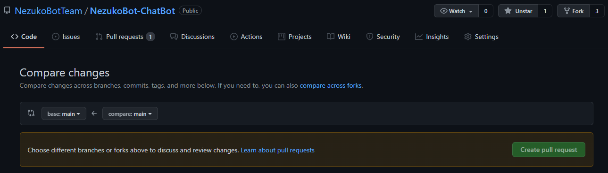

# NezukoBot-ChatBot
Module ChatBot cho NezukoBot
## Cách cài đặt và sử dụng
1. Fork Repo này về tài khoản GitHub của bạn
2. Clone Repo đã fork của bạn
3. Đi tới folder bạn chứa nó và cài module node-nlp bằng lệnh sau:
```sh
npm i node-nlp
```
3. Để trích xuất ChatBot, vui lòng xem [src/example/test.js](https://github.com/NezukoBotTeam/NezukoBot-ChatBot/tree/main/src/example)
## Cách đóng góp
Vui lòng fork repo này về GitHub của bạn để cập nhật file mẫu cho ChatBot.

ChatBot này được thiết kế như một cô gái 18 tuổi tuy nhiên vẫn biết mình là một con Bot và cách nói chuyện dễ thương.

Các thư mục Intent có sẵn:
```
greeting - Gồm các câu về chào hỏi/xã giao
disgust - Gồm các câu xúc phạm
love - Gồm các câu về tình yêu các thứ
myself - Gồm các câu về bản thân Bot
weather - Gồm các câu về thời tiết
other - Gồm các câu khác
```
Để tạo câu hỏi, vui lòng sử dụng Intent là một trong những mục có sẵn ở trên và add theo mẫu dưới (utterances là các câu hỏi trùng khớp và answers là các câu trả lời. Các câu hỏi và các câu trả lời phân tách nhau bằng dấu ',')
Ví dụ tạo mẫu câu "Cho xin tí tiền đê"
```json
{
  "intent": "other.xintien",
  "utterances": [
    "cho xin tí tiền đê",
    "cho xin tí money",
    "xin tí mắn nì nha"
  ],
  "answers": [
    "không nha :)))",
    "không"
  ]
}
```
Sau khi sửa file, vui lòng commit và push lên fork của bạn và dùng tính năng Pull Request across fork để tạo Pull Request
## Lưu ý
- Viết thường có dấu, không viết hoa chữ đầu câu hỏi (Câu trả lời thì vẫn được)
- Không được chứa nội dung 18+ (Chửi bậy, các từ ngữ tục tĩu)
- Đại từ xưng hô vui lòng là Cậu-Tớ (Cậu là user, Tớ là Bot)
- Không được chứa các link SCAM, SPAM, tự quảng bá bản thân, ...
- Không được ghi credit của bạn vào ChatBot, chúng tôi sẽ có phần khác để ghi công bạn.
- Nếu có vấn đề gì, vui lòng đặt câu hỏi ở phần Issues
- 
Sau khi đã chỉnh sửa file trên Fork của bạn, vui lòng nhấn vào [đây](https://github.com/NezukoBotTeam/NezukoBot-ChatBot/) để trở về Repo chính, tiếp đó trỏ đến phần Pull Requests và nhấn vào New pull request, một menu sẽ xuất hiện:


Chọn vào phần compare across forks và chọn Fork của bạn, có dạng @username-của-bạn/NezukoBot-ChatBot


Cuối cùng, nhấn vào Create pull request và đợi các Moderator duyệt và merge!
## Giấy phép
Được cung cấp theo giấy phép Apache-2.0. Nghĩa là, bạn có thể dùng với mục đích cá nhân, thương mại nhưng KHÔNG được dùng với mục đích mang tính ĐỘC QUYỀN hoặc các mục đích khác
